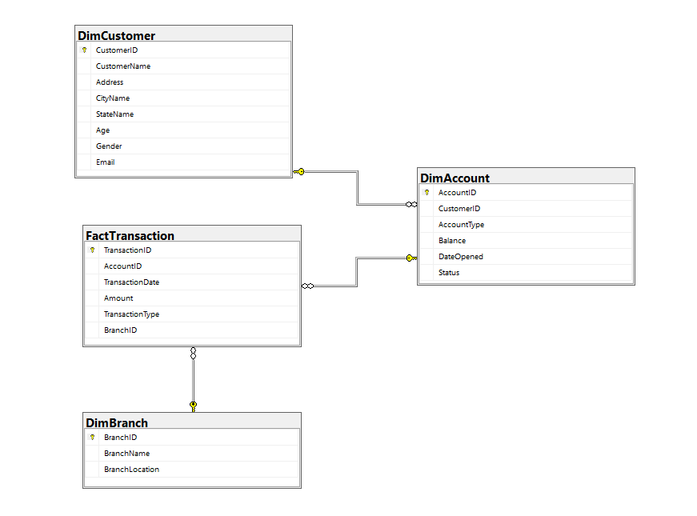

# 🏗️ End-to-End Data Engineering: Banking Data Warehouse


## 📋 Project Overview
This project simulates a real-world Data Engineering task for a banking client. The primary objective was to resolve data fragmentation issues caused by heterogeneous data sources (SQL, CSV, Excel) and to optimize the slow reporting process.

I architected a centralized **Data Warehouse** using a **Snowflake Schema** and orchestrated an automated **ETL (Extract, Transform, Load) pipeline** using Python to ensure data accessibility and quality for the analytics team.

### 🎯 Key Objectives
1.  **Data Integration:** Consolidate data from disparate sources (SQL Server, CSV files, and Excel spreadsheets) into a single source of truth.
2.  **Architecture Design:** Implement a scalable Snowflake Schema to optimize query performance and normalize data.
3.  **Automation:** Develop SQL Stored Procedures to automate complex aggregations for daily financial reporting.

---

## 🏛️ Data Architecture
The Data Warehouse is designed using the **Snowflake Schema** approach to handle the complexity of banking data efficiently.


*(Please refer to the `docs/` folder for the detailed Entity Relationship Diagram)*

**Schema Details:**
* **Fact Table:** `fact_transactions` (Contains high-volume transactional data).
* **Dimension Tables:** `dim_customer`, `dim_account`, `dim_branch`, `dim_product` (Normalized dimensions to reduce redundancy).

---

## ⚙️ Technical Implementation

### 1. ETL Pipeline (Python + Pandas + Pyodbc)
The ETL process is modularized within the `src/` directory to handle the end-to-end data lifecycle:
* **Extract:** Ingests raw data from SQL Server databases and local flat files (CSV/Excel).
* **Transform (Staging Area):**
    * Implements a **Staging Area** strategy to validate raw data before loading.
    * **Data Quality Checks:** Applies automated logic for deduplication, handling missing values, and standardizing date formats.
* **Load:** Loads cleaned data into the Data Warehouse using `pyodbc`.

### 2. Automation (SQL Stored Procedures)
To eliminate manual reporting and enable real-time tracking, I developed SQL Stored Procedures located in `sql/sp/`:

* **`sp_daily_transaction_summary`** (Daily Reports)
    * **Function:** Automates the aggregation of key metrics: **Total Transaction Volume** and **Total Transaction Value** per day.
    * **Use Case:** Used by the finance team to monitor daily liquidity and operational throughput.

* **`sp_customer_balance_snapshot`** (Balance Per Customer)
    * **Function:** Joins `DimCustomer` and `DimAccount` to provide a granular view of the **Current Balance** for every account owned by a customer.
    * **Use Case:** Enables the Customer Service team to view a "Customer 360" financial profile instantly.

## 📂 Repository Structure

```text
Banking-Data-Warehouse-ETL/
│
├── docs/
│   ├── er_diagram.png         # Snowflake Schema Blueprint
│   └── data_flow.png          # ETL Pipeline Architecture
│
├── sql/
│   ├── ddl/                   # SQL Scripts for creating Tables (Fact & Dim)
│   └── sp/                    # Stored Procedures for Daily Reporting automation
│
├── src/                       # Source code for ETL Pipeline
│   ├── __init__.py
│   ├── extract.py             # Data ingestion from SQL Server & files
│   ├── transform.py           # Data cleaning, deduplication, and staging logic
│   ├── load.py                # Batch loading to Data Warehouse
│   └── main_pipeline.py       # Orchestration script to run the full flow
│
├── .gitignore                 # Files and folders to be ignored by Git
├── requirements.txt           # Python dependencies (pandas, pyodbc, etc.)
└── README.md                  # Project Documentation
```

## 📬 Contact
Created by **Maulana Zulfikar Aziz**
Connect with me on [LinkedIn](https://www.linkedin.com/in/maulanaaz)
